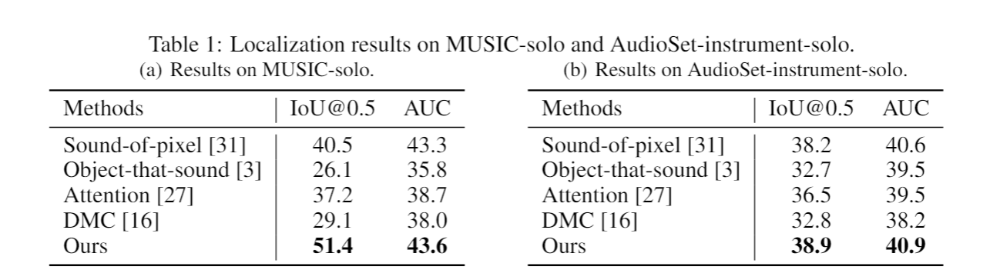
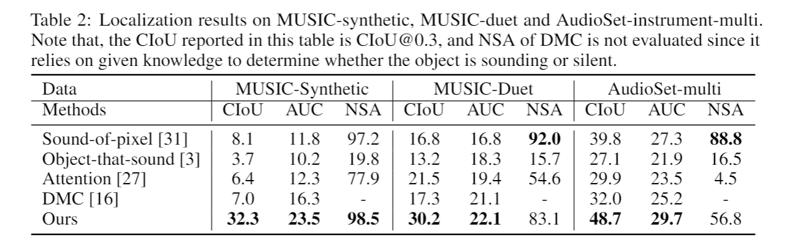
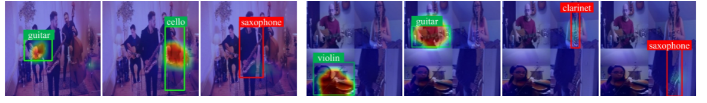
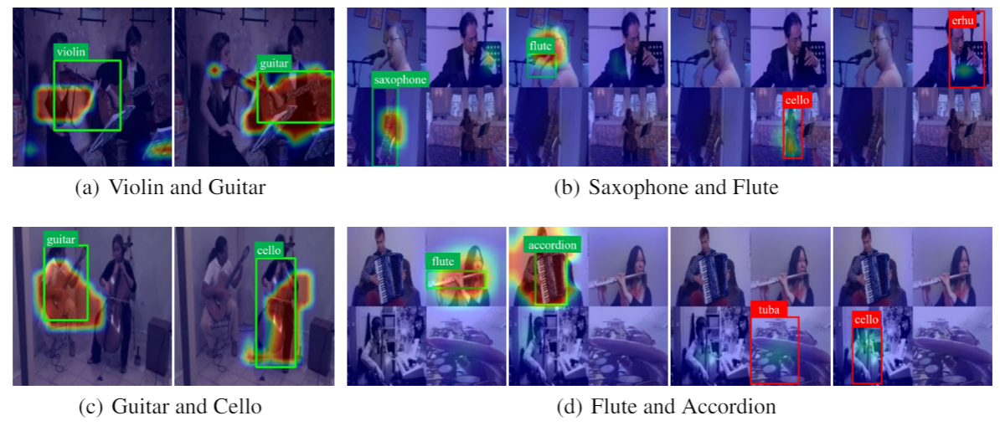

# **Discriminative Sounding Objects Localization**

Code for NeurIPS 2020 paper **Discriminative Sounding Objects Localization via Self-supervised Audiovisual Matching**. The code is implemented on PyTorch with python3.

### Requirements

- PyTorch 1.1
- torchvision
- scikit-learn
- librosa
- Pillow
- opencv

### Running Procedure

#### Data Preparation

- Download dataset, e.g., MUSIC, and split into training/validation/testing set

- Extract frames at 4 fps by running 

  ```
  python3 data/cut_video.py
  ```

- Extract 1-second audio clips and turn into Log-Mel-Spectrogram by running

  ```
  python3 data/cut_audio.py
  ```

#### Training

For experiments on Music or AudioSet-instrument, the training and evaluation procedures are similar, respectively under the folder `music-exp` and `audioset-instrument`.

##### Stage one

```
training_stage_one.py [-h]
optional arguments:
[--batch_size] training batchsize
[--learning_rate] learning rate
[--epoch] total training epoch
[--evaluate] only do testing or also training
[--use_pretrain] whether to initialize from ckpt
[--ckpt_file] the ckpt file path to be resumed
[--use_class_task] whether to use localization-classification alternative training
[--class_iter] training iterations for classification of each epoch
[--mask] mask threshold to determine whether is object or background
[--cluster] number of clusters for discrimination
```

```
python3 training_stage_one.py
```

After training of stage one, we will get the cluster pseudo labels and object dictionary of different classes in the folder `./obj_features`, which is then used in the second stage training as category-aware object representation reference.

##### Stage two

```
training_stage_two.py [-h]
optional arguments:
[--batch_size] training batchsize
[--learning_rate] learning rate
[--epoch] total training epoch
[--evaluate] only do testing or also training
[--use_pretrain] whether to initialize from ckpt
[--ckpt_file] the ckpt file path to be resumed
```

```
python3 training_stage_two.py
```

#### Evaluation

##### Stage one

We first generate localization results and save then as a pkl file, then calculate metrics, IoU and AUC and also generate visualizations, by running

```
python3 test.py
python3 tools.py
```

##### Stage two

For evaluation of stage two, i.e., class-aware sounding object localization in multi-source scenes, we first match the cluster pseudo labels generated in stage one with gt labels to accordingly assign one object category to each center representation in the object dictionary by running

```
python3 match_cluster.py
```

It is necessary to manually ensure there is one-to-one matching between object category and each center representation.

Then we generate the localization results and calculate metrics, CIoU AUC and NSA, by running

```
python3 test_stage_two.py
python3 eval.py
```

### Results

The two tables respectively show our model's performance on single-source and multi-source scenarios.





The following figures show the category-aware localization results under multi-source scenes. The green boxes mean the sounding objects while the red boxes are silent ones.



